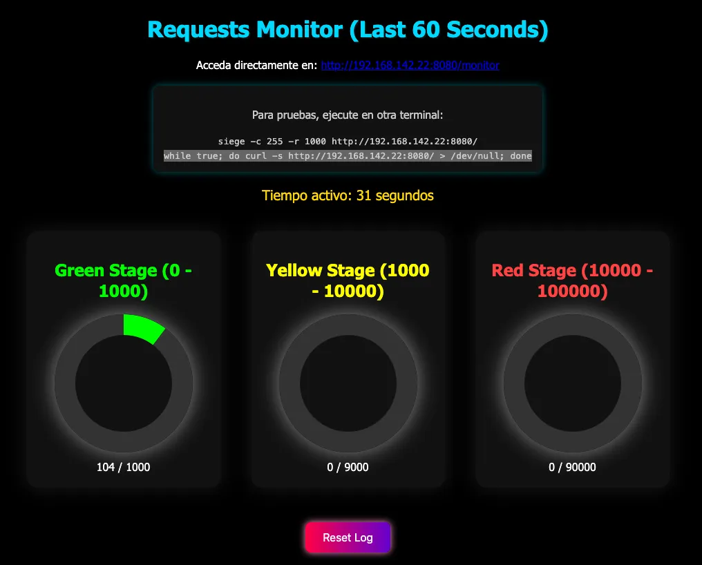
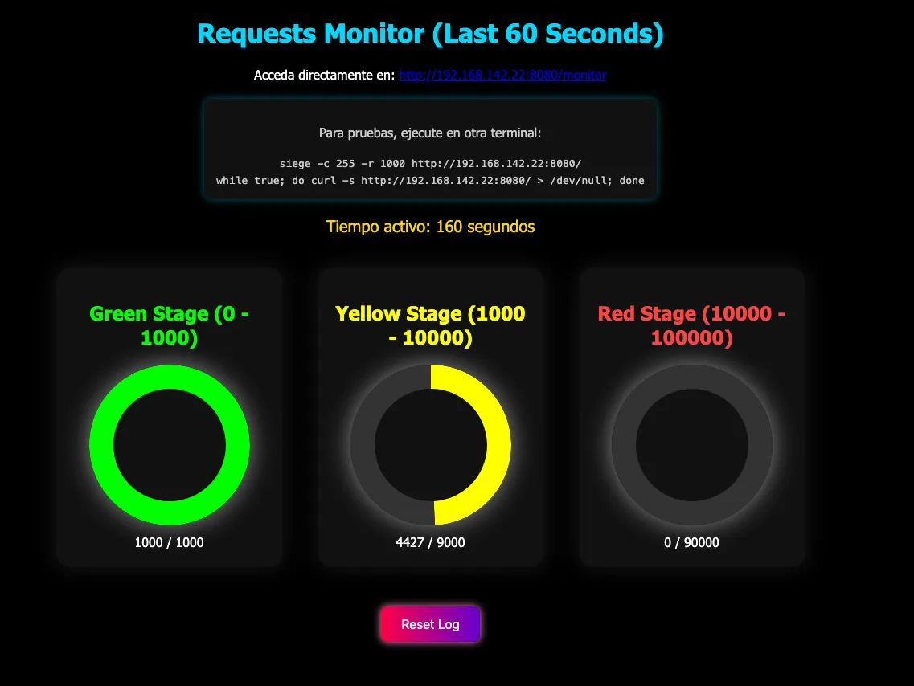
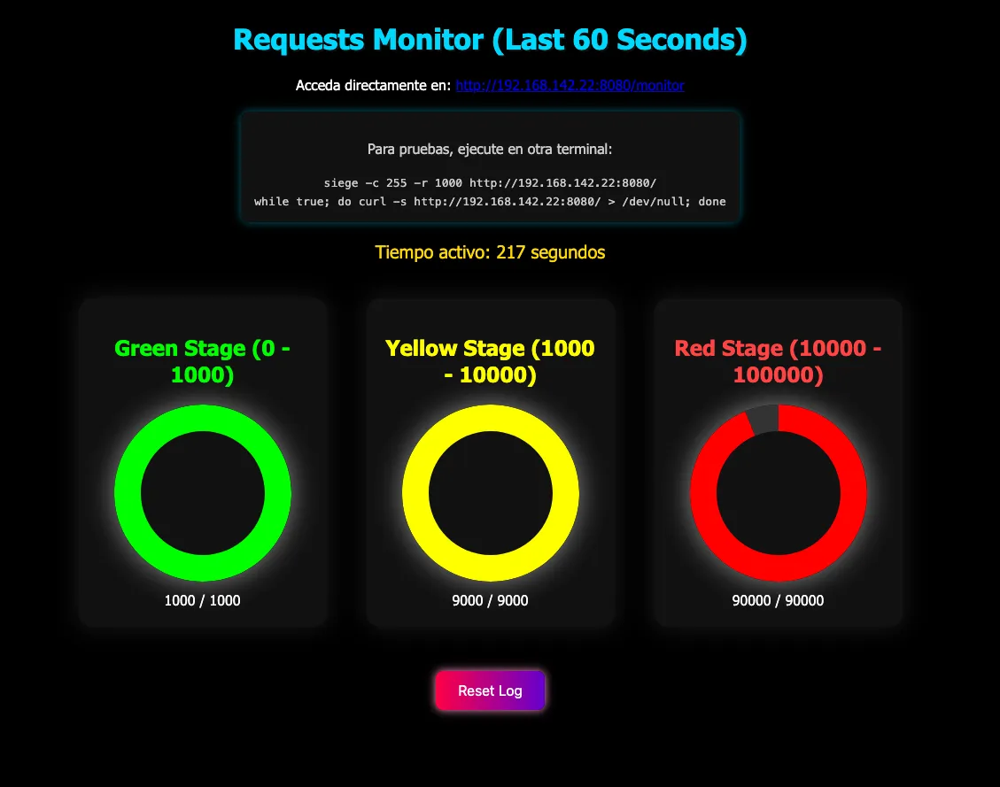

# Go Traffic Load Monitor & Generator

This project includes 3 Go-based tools designed to simulate, monitor, and stress-test web server traffic in a coordinated and visual way.

## 🔧 Tools Overview

| Tool         | Description                                                      |
|--------------|------------------------------------------------------------------|
| `webmonitor.go` | Launches a local web server with a live dashboard showing real-time request count and traffic load levels. |
| `trafico.go`    | Simulates user-like HTTP browsing traffic to common or custom URLs. |
| `siege.go`      | High-performance HTTP load generator (Siege-style) with concurrency control and metrics reporting. |

---


## 🚀 How to Use

### 1. Start the Monitoring Web Server

<p align="center">
  
</p>


```bash
go run webmonitor.go

This starts a web server on port 8080. Once running, it will auto-open your browser or you can visit it manually at:

http://<your-local-ip>:8080/monitor

You’ll see a real-time traffic dashboard with gauges for low, medium, and high load thresholds.


⸻


2. Generate Traffic with trafico.go

This simulates real HTTP GET requests to popular websites or a specific target:

go run trafico.go http://<your-local-ip>:8080

You can also run it without arguments to use predefined popular URLs (e.g., facebook.com, youtube.com, instagram.com).  

This mode simulates valid user-like traffic to real public domains for testing realistic browsing behavior.

You’ll be prompted for:
	•	Session duration in minutes
	•	Delay between requests
	•	Number of concurrent workers

⸻


3. Stress Test with siege.go

This tool simulates high-concurrency load (similar to siege):

go run siege.go http://<your-local-ip>:8080 500 1

Arguments:
	•	Target URL
	•	Number of concurrent workers
	•	Duration (in minutes)

The tool prints a detailed performance report including request rate, response time, and availability.

⸻


🧪 Test Workflow Example
	1.	In Terminal 1, run the monitor:

go run webmonitor.go


	2.	In Terminal 2, simulate browsing traffic:

go run trafico.go http://192.168.1.100:8080


	3.	In Terminal 3, fire off the stress test:

siegee 192.168.142.22:8080 50 1  
[INFO] Target: http://192.168.142.22:8080
[INFO] Concurrency: 50
[INFO] Duration: 1m0s


========= Siege Report =========
Transactions:		890580 hits
Availability:		100.00 %
Elapsed time:		60.00 secs
Response time:		0.00 secs
Transaction rate:	14843.00 trans/sec
Successful transactions:	890580
Failed transactions:		0


Watch your dashboard update in real time.
```


<p align="center">
  
</p>

⸻

<p align="center">
  
</p>
⸻


📋 Requirements
	•	Go 1.18+
	•	Chart.js (loaded via CDN in the HTML)

⸻

📄 License

MIT License

